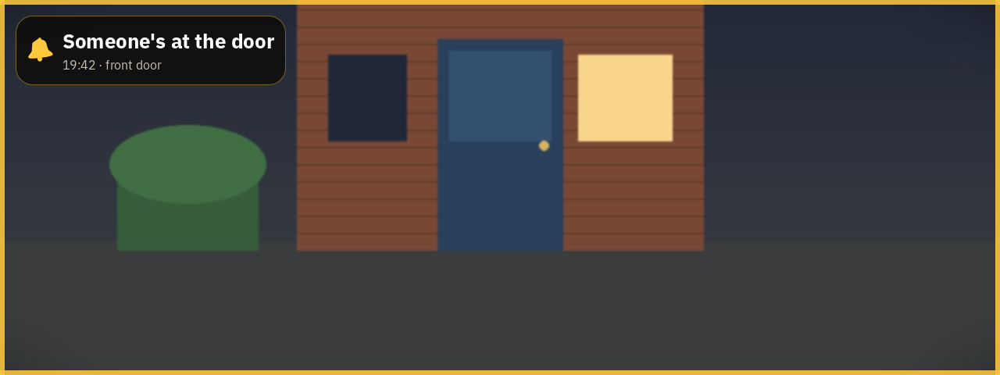

# Doorbell for the Braiins Deck

Turn your Braiins Deck into the indoor screen of a Dahua video doorbell. When someone rings, the
Deck chimes, its light strip blinks and the picture from the door comes up — all on the Deck itself,
no computer or home server needed.



- **A chime from the Deck's own speaker**, twice by default, at a volume you choose. At night
  (the Deck's own night-mode hours) it can be softer, normal, or silent.
- **The light strip blinks** in yellow, or orange, warm white, blue — or not at all.
- **The doorbell screen comes up by itself** for two minutes: a live picture refreshed every two
  seconds, a gold frame and who rang when. The rest of the time the screen stays out of your
  rotation.
- **A notification on your phone, with a photo**, if you want one — through
  [ntfy](https://ntfy.sh), straight from the Deck.
- **Optionally, open the door from the Deck.** Switch it on and a round green button with an open
  padlock appears on the doorbell screen; two taps open the door through the doorbell's own lock
  relay. Off unless you turn it on.
- **English or Dutch.**
- **Otherwise read-only towards the doorbell.** It listens and looks; it never changes a setting
  on the doorbell.

## What you need

- A **Braiins Deck** with root SSH login by key. If you can log in with a password, set up a key
  once with `ssh-copy-id root@<deck-ip>`. The Deck shows its IP when you swipe down on its screen.
- A **Dahua VTO** video doorbell on the same network, and a user name and password for its web
  interface. Tested with a VTO2202F-P-S2; other VTOs use the same interface, though the event a
  press sends can differ (see *Troubleshooting*).
- A Mac or Linux computer with `ssh` and `python3`, just to run the installer. After installing,
  the computer is no longer needed.

Tested on Deck firmware 26.09 (OpenWrt 22.03.4, widget host SDK 0.6). To see yours:

```bash
ssh root@<deck-ip> "grep -m1 -o '(host [0-9][0-9.]*)' /var/log/bmc/run-bmc-wasm-host-sdk-v0.log"   # (host 0.6.0)
```

## Install

Download this repository — **Code → Download ZIP** on GitHub, or `git clone` — and run the installer
from its folder:

```bash
cd braiins-deck-doorbell
./install.sh <deck-ip>
```

It asks for your doorbell's address, user name and password, the Deck's own web password (if you
set one) and the language. It checks that the Deck can reach the doorbell before it turns anything
on, then installs the doorbell service and the widget. The widget comes ready-made in `prebuilt/`,
so you don't need Rust or the SDK.

Then, in the Deck's web interface:

1. Add a new full-screen scene with the **Doorbell** widget. Its settings need no changes.
2. Switch that scene **off**, so it stays out of your rotation. The doorbell brings it up on its own.

Try it without going to the door:

```bash
ssh root@<deck-ip> doorbell ring
```

`install.sh` is safe to re-run — after a Deck firmware update, for instance (see below). It keeps
your settings and asks before replacing the doorbell login.

### How a widget gets onto the Deck ("sideloading")

The Deck runs widgets from its own package manager, a small Nix store. Braiins' widgets arrive with
firmware updates; your own you add yourself over SSH, which is what `install.sh` does for this
widget:

1. copy the packaged widget (`prebuilt/doorbell-widget-<version>.tar.gz`) to the Deck;
2. add it to the Deck's store: `nix-store --add /tmp/bmc-widget-doorbell`;
3. register it: `bmc-nix-cli add-packages --name widget-doorbell --version <version> --store-path <path>`.

From then on, **Doorbell** is in the widget list of the Deck's web interface like any other widget.
The same three steps work for any widget built with the
[Braiins Deck SDK](https://github.com/BraiinsForge/bmc-main) and packaged the same way (see
`package.sh`).

A firmware update can remove what you added. Run `./install.sh <deck-ip>` again afterwards.

## Settings

Everything lives in `/etc/config/doorbell` on the Deck. Change a setting with `uci`; it takes effect
at the next ring:

```bash
ssh root@<deck-ip> 'uci set doorbell.main.volume=60; uci commit doorbell'
```

| Option       | Default         | What it does                                                                 |
| ------------ | --------------- | ---------------------------------------------------------------------------- |
| `volume`     | `70`            | Chime volume in percent, on the same scale as the Deck's own volume          |
| `night`      | `soft`          | During the Deck's night mode: `normal`, `soft` (25 points quieter) or `off`  |
| `repeats`    | `2`             | How many times it chimes                                                     |
| `interval`   | `15`            | Seconds between chimes                                                       |
| `led`        | `1`             | Blink the light strip (`1`) or not (`0`)                                     |
| `led_color`  | `FFC800`        | Light strip colour, `RRGGBB`                                                 |
| `lang`       | `en`            | `en` or `nl`: the text on screen and in notifications                        |
| `name`       | `front door`    | Name of the door, shown under "Someone's at the door"                        |
| `ntfy_url`   | —               | An [ntfy](https://ntfy.sh) topic URL, e.g. `https://ntfy.sh/<your-topic>`: a notification with a photo of the door |
| `ping_url`   | —               | A URL of your own to call on every ring (`?name=…&at=…&lang=…`), e.g. a Home Assistant webhook |
| `unlock`     | `0`             | `1` shows the button that opens the door (see *Opening the door*)            |
| `door`       | `1`             | Which of the doorbell's lock relays the button opens                         |
| `debug`      | `0`             | `1` logs every event the doorbell sends (`logread -e doorbell`)              |

Pick a long, random ntfy topic name: anyone who knows it can read the notifications.

## Opening the door

With `unlock` set to `1`, the doorbell screen gets a round green button with an open padlock in the
bottom right corner ("Unlock" / "Ontgrendelen"). Tap it once and it asks you to tap again; a second
tap within four seconds opens the door, through the same lock relay the doorbell's own app uses
(`accessControl.cgi?action=openDoor`). How long the lock stays open is set in the doorbell itself.

This only opens a door if an electric lock or door strike is wired to the doorbell's lock relay — if
the *open* button in the doorbell's own app does nothing, this button won't either. Tested on a
VTO2202F-P-S2: it accepts the command and switches its relay.

```bash
ssh root@<deck-ip> 'uci set doorbell.main.unlock=1; uci commit doorbell'
```

Because this opens your front door, it is guarded:

- **Off by default**, and switching it off takes the button away and makes the service refuse.
- **Only from the Deck itself.** The button calls a script on the Deck's own web server, which
  listens on `127.0.0.1` only and accepts POST only; nothing on your network can reach it.
- **Two taps**, so a passing swipe can't open the door.
- **At most once every 10 seconds.**
- **Every opening is logged** (`logread -e doorbell`) and sent to `ntfy_url` and `ping_url` like a
  ring, as "Door unlocked from the Deck".

Anyone who can touch your Deck can open the door while the button is on. Keep it off if the Deck
stands somewhere others can reach it.

## How it works

```text
                event stream (HTTPS, digest auth)
 Dahua VTO ───────────────────────────────────▶ doorbell service ──▶ chime (madplay → speaker)
     ▲                                            │      │
     │ snapshot.cgi                               │      └──────────▶ scene on screen (Deck web API)
     │                                            ▼                    + optional ntfy / your URL
 doorbell-jpg / doorbell-status (CGI, Deck only) ◀── Doorbell widget ──▶ light strip blinks
```

- **`deck/doorbell`** (a shell script, run by procd so it restarts if it ever stops) keeps one
  connection open to the VTO's event stream with `curl`. A press of the call button arrives as an
  event; one ring is counted per 20 seconds, however many events the press sends.
- **The chime** is a short two-tone bell (`deck/ding_dong.mp3`, made for this project) played with
  the Deck's own `madplay`. Widgets on this firmware cannot play sound — the widget host is built
  without audio — so the service does it.
- **The screen**: the service finds the scene that holds the Doorbell widget through the Deck's own
  web API (`deck/scene.lua` reads the scene list) and shows it with the same preview function the
  web interface uses, for two minutes.
- **The widget** reads the picture and the ring status from two small CGI scripts on the Deck's
  local web server, which only the Deck itself can reach. It shows the overlay and blinks the light
  strip. It is built on the Image widget from the Braiins Deck SDK.
- **curl** is not part of the Deck's firmware. `install.sh` adds it from OpenWrt 22.03.4's official
  packages — the release and CPU architecture the Deck's firmware is built on — and checks each
  package's SHA-256 before installing it.
- **Credentials** stay on the Deck, readable by root only: `/etc/doorbell/vto.conf` (the doorbell
  login) and `/etc/doorbell/deck-password` (the Deck's web password, needed to switch screens). The
  doorbell password is handed to `curl` through a file in RAM, never on a command line.

## Troubleshooting

- `ssh root@<deck-ip> doorbell status` shows the last ring and whether the service hears the
  doorbell (`"events":{"ok":true,…}`).
- `ssh root@<deck-ip> logread -e doorbell` shows what the service did.
- **Pressing the button does nothing, but `doorbell ring` works:** your VTO may send a different
  event. Turn on `debug`, press the button, and look for the event in `logread -e doorbell`. The
  events the service reacts to are in `RING_RE` in `deck/doorbell`.
- **No chime while music plays over AirPlay:** only one program can use the Deck's speaker at a
  time.

## Uninstall

```bash
./uninstall.sh <deck-ip>   # the widget and the service (curl stays installed)
```

Then delete the doorbell scene in the Deck's web interface.

## What's on the Deck

| Path                                   | What                                                        |
| -------------------------------------- | ----------------------------------------------------------- |
| `/usr/sbin/doorbell`                   | The service                                                 |
| `/etc/init.d/doorbell`                 | Starts it at boot                                           |
| `/etc/config/doorbell`                 | Settings                                                    |
| `/etc/doorbell/`                       | Doorbell login and Deck password (root only)                |
| `/usr/share/doorbell/`                 | The chime and the scene finder                              |
| `/www/cgi-bin/doorbell-status`, `/www/cgi-bin/doorbell-jpg` | Status and picture for the widget, on the Deck only |
| `/www/cgi-bin/doorbell-unlock`         | Opens the door for the widget's button (POST, on the Deck only, refused unless `unlock` is on) |
| curl, libcurl4, libnghttp2-14          | From OpenWrt 22.03.4, installed with `opkg`                 |
| `widget-doorbell` package              | The widget, added with the Deck's own package manager (`bmc-nix-cli`) |

## Develop

The widget is Rust compiled to WebAssembly, built against the Braiins Deck SDK in `bmc-sdk/` — a
submodule of [BraiinsForge/bmc-main](https://github.com/BraiinsForge/bmc-main), pinned to the commit
this was tested against. Building needs git, [Git LFS](https://git-lfs.com),
[Rust](https://rustup.rs) (the pinned version installs itself) and python3:

```bash
git lfs install
git clone --recurse-submodules https://github.com/JaccoElektro/braiins-deck-doorbell.git
cd braiins-deck-doorbell
./deploy.sh <deck-ip>      # build, package into prebuilt/ and install the widget
```

After changing the widget, bump `version` in both `doorbell/manifest.json` and
`doorbell/Cargo.toml`, run `./package.sh` (or `./deploy.sh`) and commit `prebuilt/` too — that is
what people without a build setup install. The package is reproducible: the same source gives the
same file. `./check.sh` checks that the versions agree; `./check.sh --build` rebuilds the package
and checks it comes out identical to the one in `prebuilt/`.

After changing a file in `deck/`, run `./install.sh <deck-ip>` again.

## License

GPL-3.0-or-later; see [LICENSE](LICENSE). The widget is built with the Braiins Deck SDK and on its
Image widget, which are GPL-3.0-or-later. curl and its libraries are downloaded from OpenWrt at
install time, under their own licenses.

This is an independent project, not made or endorsed by Braiins or Dahua.
